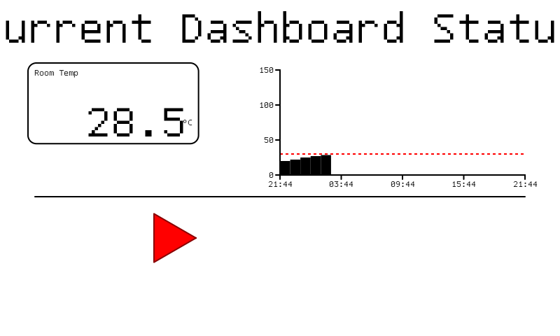

# csirender


`csirender` is a powerful, extensible, declarative 2D rendering engine written in Go. It enables you to design dynamic, data-driven dashboards and interfaces using simple YAML or JSON configurations, and render them to standard image formats (PNG, BMP) or raw data streams optimized for EPD (e-ink) displays.


*(Image generated automatically from [`assets/example.yaml`](assets/example.yaml))*

---

## 🚀 Features

- **Declarative Configuration**: Define your entire layout (Text, Charts, Value Cards, Lines, Images, Shapes) directly in YAML or JSON without writing rendering code.
- **Dynamic Styling (Thresholds)**: Change colors, backgrounds, image paths, and opacity dynamically based on real-time telemetry conditions (e.g., turn a background red if `temperature > 30`).
- **Rich Elements**:
  - **Text**: Custom TrueType fonts, automatic text fitting, dynamic templating.
  - **Images**: PNG/JPEG/GIF support, scaling modes (fit, stretch, center), and alpha transparency.
  - **Charts**: Built-in line charts with customizable axes and threshold lines.
  - **Shapes**: Rectangles, circles, ellipses, and polygons with dynamic rotations (perfect for compasses/gauges).
- **Extensible Architecture**: Implement the `CustomRenderer` interface to draw your own domain-specific components via a plugin system.
- **Optimized Caching Pipeline**: The built-in `Parser[T]` seamlessly loads, caches, and watches configuration files for changes, ensuring your application only re-parses when necessary.

---

## 📦 Installation

```bash
go get github.com/ABespalov/csirender
```

---

## 🛠 Integration & Embedding Guide

`csirender` is designed to be deeply embedded into your business applications. 

### 1. Define your Application Config
You can extend the base `LayoutConfig` with your own application-specific fields (like database credentials, server ports, etc.):

```go
package main

import (
	"fmt"
	"github.com/ABespalov/csirender"
)

// AppConfig embeds csirender.LayoutConfig and adds custom logic
type AppConfig struct {
	csirender.LayoutConfig `yaml:",inline" json:",inline"`
	ListenAddr             string `yaml:"listen_addr" json:"listen_addr"`
}

// Create a caching parser for your specific config struct
var parser = csirender.NewParser[*AppConfig]()

func main() {
	// Parse loads and caches the layout
	cfg, err := parser.Parse("layout.yaml")
	if err != nil {
		panic(err)
	}
	fmt.Printf("Starting server on %s with screen width %d\n", cfg.ListenAddr, cfg.Screen.Width)
}
```

### 2. Prepare Telemetry and Render
Create an `Engine`, feed it your live data via `RenderData`, and generate the final image.

```go
engine := csirender.New()

// Wrap flat maps using MapDataProvider for backward compatibility,
// or implement your own DataProvider for lazy evaluation!
data := &csirender.MapDataProvider{
	Data: csirender.RenderData{
		Values: map[string]interface{}{
			"temperature": 28.5,
			"weather_condition": "sun",
		},
		Charts: map[string][]float64{
			"temperature_history": {20, 22, 25, 27, 28.5},
		},
	},
}

// RenderWithProvider returns an image.Image
img, err := engine.RenderWithProvider(&cfg.LayoutConfig, data)
if err != nil {
	panic(err)
}

// You can now encode `img` to PNG/BMP and send it over HTTP or SPI.
```

*For a complete, runnable client-server architecture, see the [`examples/server/`](examples/server/) and [`examples/client/`](examples/client/) examples.*

---

## ⚙️ Configuration Reference

The library revolves around the `LayoutConfig` structure. Below is a comprehensive guide to its keys.

### Global Settings

| Key | Description |
|---|---|
| `screen.width` / `height` | Canvas dimensions in pixels. |
| `screen.anti_aliasing` | Boolean. Enable for smooth lines, disable for sharp, pixel-perfect e-ink rendering. |
| `screen.palette` | Map of logical color names to Hex codes (e.g., `white: "#FFFFFF"`). |
| `output.format` | Desired output serialization (`png`, `bmp`, `epd_raw`). |
| `output.background` | Base canvas fill color. |
| `fonts.<name>` | Define reusable font faces. Provide `file` (path to `.ttf`), `size`, and `hinting` (`full`, `vertical`, `none`). |

### Elements

All elements share these base properties:
- `type`: Element kind (`text`, `value`, `chart`, `line`, `image`, `shape`).
- `position`: `x` and `y` offset from the top-left corner.
- `size`: `w` and `h` bounding box dimensions.
- `source`: The telemetry key this element reacts to (e.g., `temperature`).

#### 1. Text (`type: text`)
Displays static or dynamic strings.
- `template`: A formatting string.
- `font`: References a font from the global `fonts` block. Defines `face`, `fg` (foreground color), and `bg`.
- `align`: `h` (`left`, `center`, `right`) and `v` (`top`, `center`, `bottom`).
- `fit_text`: Boolean. Automatically scales down the font to fit the bounding box.

#### 2. Value Card (`type: value`)
A complex component containing a `value`, `label`, and `unit`, wrapped in an optional `border`.
- `format`: `fmt.Sprintf` style formatting (e.g., `%.1f`).
- `value`, `label`, `unit`: Sub-configurations with their own `font`, `align`, and `template`.
- `border`: Configuration for stroke (`t`, `color`) and background (`bg`).
- **Dynamic Thresholds**:
  ```yaml
  thresholds:
    - condition: "val > 30.0"
      bg: red
      fg: white
  ```

#### 3. Chart (`type: chart`)
Plots historical data arrays.
- `points`: Number of data points to display on the X-axis.
- `axis`: Configuration for `x` and `y` axes (visibility, labels, fonts).
- `threshold_lines`: Draw horizontal lines across the chart at specific `value`s with custom `color` and `style` (e.g., `dashed.4.4`).
- `thresholds`: Color regions of the chart based on the value.

#### 4. Image (`type: image`)
Renders bitmap files.
- `path`: Path to the image file.
- `mode`: `fit` (maintains aspect ratio), `stretch` (fills bounds), or `center` (original size).
- `opacity`: Float between `0.0` and `1.0`.
- **Dynamic Swapping**:
  ```yaml
  thresholds:
    - condition: "val == 'rain'"
      path: "assets/images/rain.png"
  ```

#### 5. Shape (`type: shape`)
Draws geometric primitives.
- `kind`: `rect`, `circle`, `ellipse`, `polygon`.
- `color`: Fill color.
- `border`: Stroke settings.
- `sides`: Number of sides (for `polygon`).
- `rotation`: Static rotation in degrees.
- `rotation_expr`: Dynamic expression linked to telemetry (e.g., mapping wind direction to compass arrow rotation).

---

## 📜 Changelog

### v0.2.0
- Replaced `RenderData` with `DataProvider` interface for lazy evaluation of telemetry values and charts.
- Added `RenderWithProvider` for new API consumers.
- Maintained backward compatibility via `MapDataProvider`.

### v0.1.0 (Initial Release)
- Core declarative rendering engine.
- Support for `text`, `value`, `chart`, `line`, `image`, and `shape` elements.
- Caching `Parser[T]` for high-performance configuration reloading.
- Dynamic threshold styling via condition evaluation.
- Extensible `CustomRenderer` interface.

---

## 📄 License
Copyright (c) 2026, Anton Bespalov. Licensed under the [MIT License](LICENSE).
